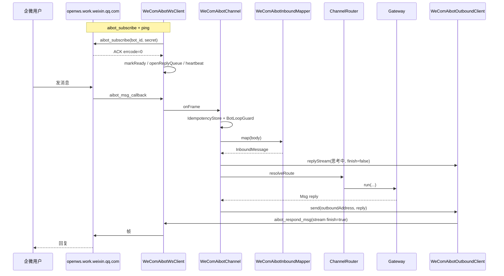

# agentscope-extensions-channel-wecom-aibot

企业微信**智能机器人**（API 长连接）Channel 扩展模块 —— 为 AgentScope Harness Gateway 提供对接企微 AI Bot 的入站/出站能力。

## 概述

本模块基于企业微信官方 **智能机器人长连接协议**（`wss://openws.work.weixin.qq.com`，`aibot_subscribe` 认证）实现接入，与下列模块相互独立：

| 模块 | TYPE | 产品形态 | 传输 |
|------|------|----------|------|
| `agentscope-extensions-channel-wecom` | `wecom` | 自建应用 | HTTP 加密回调 |
| **本模块** | `wecom-aibot` | 智能机器人（API 模式 > 长连接） | WebSocket |
| `agentscope-extensions-channel-weixin` | `weixin` | 微信个人号 iLink Bot | HTTP 长轮询 |

**核心特性：**

- **入站**：WebSocket 接收 `aibot_msg_callback` / `aibot_event_callback`（无需公网 webhook）。
- **出站**：`aibot_respond_msg`（绑定入站 `req_id`）、`aibot_send_msg`（单聊主动推）、`aibot_respond_welcome_msg`、stream 占位覆盖。
- **认证**：`bot_id` + `secret`；可延迟填写（宿主扫码后再 `onCredentialsUpdated`）；提供 `WeComAibotVerifier` 一次性探针。
- **媒体**：入站 AES-256-CBC 解密落盘为 `ImageBlock`/`DataBlock`（无后缀默认 `image.jpg`，magic-byte 纠正）；出站分块上传（`aibot_upload_media_*`）后发原生 `media_id` 消息；上传限制与图片压缩。
- **群聊**：缓存 `lastChatReqIds`，群主动推优先走 `aibot_respond_msg`（平台拒绝群聊裸 `aibot_send_msg`）。
- **可靠性**：心跳、指数退避重连、stale socket 忽略、`disconnectInflight` 去重、reply 队列串行与 gate、IdempotencyStore / BotLoopGuard。
- **卡片**：`template_card` 发送与 `template_card_event` 点击路由（`WeComAibotCardHandler` SPI，不绑定具体审批业务）。

> 扫码授权 UI **不在本模块**。宿主可使用官方 CDN `wecom-aibot-sdk` 弹窗拿 `botid`/`secret`，再写入配置或调用 `onCredentialsUpdated`。

## 模块结构

```
agentscope-extensions-channel-wecom-aibot/
├── pom.xml
├── README.md
└── src/main/java/io/agentscope/extensions/channel/wecomaibot/
    ├── WeComAibotChannel.java              # implements Channel, TYPE="wecom-aibot"
    ├── WeComAibotChannelProperties.java    # record + from(map) 配置
    ├── WeComAibotChannelRegistry.java      # channelId → Channel 进程级单例
    ├── WeComAibotWsClient.java             # 连接 / 认证 / 心跳 / 重连 / 帧收发
    ├── WeComAibotInboundMapper.java        # body JSON → InboundMessage
    ├── WeComAibotOutboundClient.java       # Msg → 协议帧（markdown / stream / welcome）
    ├── WeComAibotReplyQueue.java           # 按 inbound req_id 串行 + gate + idle close
    ├── WeComAibotGroupReplyReqIdCache.java # 群聊 lastChatReqIds LRU
    ├── WeComAibotKeepalive.java            # stream 占位 20s 续命 / 180s 强制结束
    ├── WeComAibotMediaCrypto.java          # AES-256-CBC 入站解密
    ├── WeComAibotMediaUploader.java        # init / chunk / finish 上传
    ├── WeComAibotUploadLimits.java         # 大小 / MIME 预检
    ├── WeComAibotMediaTypeSniffer.java     # 入站 magic-byte 扩展名
    ├── WeComAibotMarkdownTables.java       # 出站 Markdown 表格列宽对齐
    ├── WeComAibotImageCompressor.java      # >1.9MB JPEG 压缩
    ├── WeComAibotExponentialBackoff.java   # 重连退避
    ├── WeComAibotVerifier.java             # 一次性 WS 凭证探针
    └── card/
        ├── WeComAibotCardDispatcher.java
        ├── WeComAibotCardHandler.java
        └── WeComAibotCardEvent.java
```

## 数据流



## 使用说明

### 1. 添加依赖

```xml
<dependency>
    <groupId>io.agentscope</groupId>
    <artifactId>agentscope-extensions-channel-wecom-aibot</artifactId>
    <version>${revision}</version>
</dependency>
```

### 2. 注册 Channel 类型

在宿主应用的 `ChannelTypeRegistry` 静态块中追加：

```java
register(WeComAibotChannel.TYPE, WeComAibotChannel::fromProperties);
```

> 本模块不通过 SPI / `spring.factories` 自注册，需由接入方显式注册，与 `dingtalk` / `feishu` / `wecom` / `weixin` 扩展保持一致。

### 3. 前置准备（企微后台）

1. 打开 [企业微信管理后台](https://work.weixin.qq.com/)
2. 工作台 → **智能机器人** → 创建机器人
3. 选择 **API 模式** → **长连接**
4. 取得 **Bot ID** 与 **Secret**（或由宿主前端 SDK 扫码授权回填）

### 4. 编程式接入

```java
WeComAibotChannel channel = WeComAibotChannel.fromProperties(
    "my-aibot",
    ChannelConfig.of("my-aibot", "main"),
    Map.of(
        "botId",  "your-bot-id",
        "secret", "your-secret",
        "welcomeText", "你好，我是助手"
    ));

GatewayBootstrap gw = GatewayBootstrap.builder()
    .agent("main", agent)
    .channel(channel)
    .build();
gw.start();
```

**延迟凭证（先建 channel，扫码后再连）：**

```java
WeComAibotChannel channel = WeComAibotChannel.fromProperties(
    "my-aibot", ChannelConfig.of("my-aibot", "main"), Map.of());
// start() 仅 registry.register，不连 WS
channel.start();
// 扫码拿到凭证后：
channel.onCredentialsUpdated(botId, secret);
```

**凭证预检（可选）：**

```java
WeComAibotVerifier.Result r = WeComAibotVerifier.verify(botId, secret);
if (!r.success()) {
    // r.message() / r.errcode()
}
```

### 5. 配置 agentscope.json

```json
{
  "channels": {
    "wecom-bot-1": {
      "type": "wecom-aibot",
      "defaultAgentId": "default",
      "dmScope": "PER_PEER",
      "properties": {
        "botId": "your-bot-id",
        "secret": "your-secret",
        "welcomeText": "你好，我是助手",
        "mediaDownloadEnabled": true,
        "mediaDir": "data/wecom-aibot/wecom-bot-1",
        "maxReconnectAttempts": 8
      }
    }
  }
}
```

**配置项说明：**

| 字段 | 类型 | 必填 | 默认值 | 说明 |
|------|------|------|--------|------|
| `botId` / `bot_id` | string | 运行时必填 | — | 可与 `secret` **同时缺省**创建；不可只填其一 |
| `secret` | string | 同上 | — | |
| `wsUrl` | string | 否 | `wss://openws.work.weixin.qq.com` | WebSocket 地址 |
| `welcomeText` | string | 否 | `""` | `enter_chat` 欢迎语 |
| `mediaDownloadEnabled` | boolean | 否 | `true` | 是否下载/解密入站媒体 |
| `mediaDir` | string | 否 | `data/wecom-aibot/{channelId}` | 入站媒体目录 |
| `maxReconnectAttempts` | int | 否 | `8` | `-1` = 无限重连 |
| `heartbeatIntervalMs` | long | 否 | `30000` | 心跳间隔 |
| `maxMissedPong` | int | 否 | `2` | 连续未 ACK 次数后断开重连 |
| `replyAckTimeoutMs` | long | 否 | `5000` | 回复帧 ACK 超时 |
| `replyWorkerIdleMs` | long | 否 | `60000` | reply 队列 worker 空闲关闭 |
| `keepaliveRefreshSec` | long | 否 | `20` | stream 占位刷新间隔 |
| `keepaliveMaxSec` | long | 否 | `180` | stream 占位最长时长 |

### 6. 模板卡片 SPI

```java
channel.cardDispatcher().register("tg_approval_", event -> {
    // 尽快处理；更新卡片须使用 event.frameReqId()（平台约 5s 窗口）
    return Map.of(
        "msgtype", "update_template_card",
        "update_template_card", /* ... */);
});
```

发送卡片：`outbound` / Channel 侧通过 `WeComAibotOutboundClient#sendTemplateCard(frameReqId, templateCardBody)`。

### 7. 出站主动推送

`WeComAibotChannel.deliver(OutboundAddress, List<Msg>)` 可用。`OutboundAddress.to` 格式为 `channelId:kind:peerId`，例如：

- 私聊：`wecom-bot-1:DIRECT:userid`
- 群聊：`wecom-bot-1:GROUP:chatid`

群聊主动推：若缓存中有该 `chatid` 的最近入站 `req_id`，走 `aibot_respond_msg`；否则降级 `aibot_send_msg`（可能被平台拒绝，见「已知限制」）。

## 消息类型支持

**入站（`body.msgtype`）：**

| msgtype | 行为 |
|---------|------|
| `text` | `TextBlock` → Agent |
| `voice` | ASR 文本 `TextBlock`；空则 `[语音消息]` |
| `image` | 下载+AES 解密落盘 → `ImageBlock`（`file://`）；无 filename 时默认 `image.jpg`（企微 URL 常无后缀）；可选 magic-byte 纠正扩展名 |
| `file` | 下载落盘 → `DataBlock`；无扩展名时可 sniff |
| `mixed` | 展开 `msg_item[]` 为多块 |
| `appmsg` | `file`/`image`/`miniprogram`/`url`（公众号链接附加防幻觉提示） |
| `video` 及其他 | **忽略**（不 dispatch） |
| `quote`（字段） | 前缀 `[引用消息: …]` + 引用媒体块 |

**事件（`aibot_event_callback`）：**

| eventtype | 行为 |
|-----------|------|
| `enter_chat` | 非空 `welcomeText` → `aibot_respond_welcome_msg` |
| `template_card_event` | `WeComAibotCardDispatcher` |
| 其他 | debug ignore |

**出站：**

| 场景 | cmd / msgtype |
|------|----------------|
| Agent 文本回复（有 reply context） | `aibot_respond_msg` + `stream`（先占位，再 `finish=true` 覆盖；表格列宽对齐） |
| Agent 图片/文件/语音/视频块 | 上传 `aibot_upload_media_*` → `msgtype=image\|file\|voice\|video` + `media_id` |
| 单聊主动推 | `aibot_send_msg` + `markdown` / media |
| 群聊主动推（有缓存 req_id） | `aibot_respond_msg` + `markdown` / media |
| 欢迎语 | `aibot_respond_welcome_msg` + `text` |
| 卡片 | `aibot_respond_msg` + `template_card` / `aibot_respond_update_msg` |

## 协议命令一览

| cmd | 方向 | 用途 |
|-----|------|------|
| `aibot_subscribe` | 出站 | 认证 |
| `ping` | 出站 | 心跳 |
| `aibot_msg_callback` | 入站 | 用户消息 |
| `aibot_event_callback` | 入站 | 事件 |
| `aibot_respond_msg` | 出站 | 绑定入站 req_id 的回复 |
| `aibot_respond_welcome_msg` | 出站 | 欢迎语 |
| `aibot_respond_update_msg` | 出站 | 更新 template_card |
| `aibot_send_msg` | 出站 | 单聊主动推送 |
| `aibot_upload_media_init` / `_chunk` / `_finish` | 出站 | 媒体上传 |

ACK 帧通常无 `cmd`，按 `headers.req_id` 匹配，顶层含 `errcode` / `errmsg`。

## 生命周期与边界（摘要）

| 场景 | 行为 |
|------|------|
| 缺 botId/secret 时 `start()` | warn，仅注册，不连 WS |
| subscribe `errcode≠0` | failure → 重连（禁止 zombie「已连接」） |
| 心跳连续 2 次无 ACK | 断线重连 |
| 同一次故障多入口 | `disconnectInflight` 仅首次处理 |
| 旧 socket 回调 | 忽略（stale socket） |
| 重连 | 重建 `HttpClient`（防 SSL session 污染） |
| reply 队列未 open | `sendFrameWithAck` 立即失败 |
| dispatch / deliver 失败 | inbound 边界 swallow + warn，不拆 WS |

## 已知限制

1. 群聊在无 `lastChatReqIds` 缓存时主动推可能被平台拒绝。
2. 入站 `video` 未支持（ignore）。
3. 无 bot 自消息专用过滤。
4. 卡片更新依赖平台约 5s 窗口，超时无重试。
5. 同 bot 凭证多进程会重复消费（**single-leader**）。
6. 扫码授权 UI 不在本模块（宿主集成官方 `wecom-aibot-sdk`）。
7. 入站媒体下载关闭或失败时，加密 COS URL 对模型通常不可读；请保持 `mediaDownloadEnabled=true`。

## 相关文档

- 集成指南（文档站）：[`docs/v2/zh/integration/channel/wecom-aibot.md`](../../../../docs/v2/zh/integration/channel/wecom-aibot.md)
- 回调版企微对比：[`docs/v2/zh/integration/channel/wecom.md`](../../../../docs/v2/zh/integration/channel/wecom.md)
- Channel 架构：[`docs/v2/zh/docs/harness/channel.md`](../../../../docs/v2/zh/docs/harness/channel.md)
