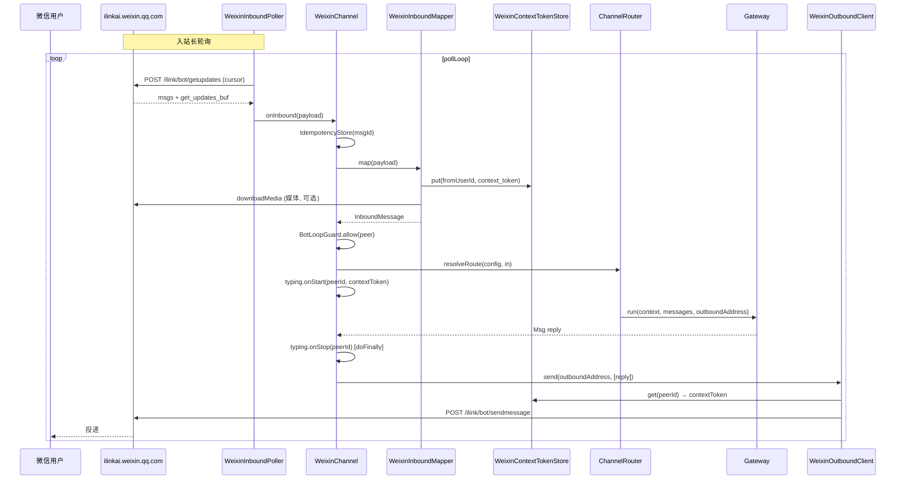

# agentscope-extensions-channel-weixin

微信个人号（iLink Bot）Channel 扩展模块 —— 为 AgentScope Harness Gateway 提供对接微信个人号的入站/出站能力。

## 概述

本模块基于微信官方 **iLink Bot HTTP API**（`https://ilinkai.weixin.qq.com`）实现个人号机器人接入，与已有的 `agentscope-extensions-channel-wecom`（企业微信）相互独立。

**核心特性：**

- **入站**：HTTP 长轮询 `POST /ilink/bot/getupdates`（服务端最长持有 35 秒），由守护线程驱动，无需公网 webhook。
- **出站**：`POST /ilink/bot/sendmessage`，支持文本、图片、语音、视频、文件五类消息。
- **认证**：Bearer Token，通过扫码登录获取（二维码由 iLink 生成，扫码确认后回传 `bot_token`）。
- **媒体**：CDN 上传/下载 + AES-128-ECB + PKCS5Padding 加解密，自动识别三种 key 编码（hex / base64-raw / base64-hex）。
- **多模态**：入站媒体下载落盘后构造 `Msg.content` 多模态 blocks（`ImageBlock` / `AudioBlock` / `VideoBlock` / `DataBlock`）；出站遍历 `Msg.content` 按 block 类型分发到对应 `ILinkClient.sendXxx`。
- **会话**：通过 `context_token` 维持对话上下文，每 peer 缓存最新 token，支持同步回复与主动推送。
- **输入中提示**：dispatch 期间周期性 `sendtyping(status=1)`，发送前 `status=2`。
- **扫码登录端点**：`WeixinQrAuthController` 暴露 `GET /api/channels/weixin/{channelId}/qrcode` 与 `/qrcode/status`，确认后自动重启长轮询。
- **Token 失效保护**：401/403 触发 `TokenExpiredException`，poller 自动停转，等待重新扫码。

## 模块结构

```
agentscope-extensions-channel-weixin/
├── pom.xml
└── src/main/java/io/agentscope/extensions/channel/weixin/
    ├── WeixinChannel.java              # implements Channel, TYPE="weixin"
    ├── WeixinChannelProperties.java    # record + from(map) 配置
    ├── WeixinChannelRegistry.java      # channelId → WeixinChannel 进程级单例
    ├── WeixinInboundPoller.java        # 长轮询守护线程
    ├── WeixinInboundMapper.java        # iLink payload → InboundMessage（全量媒体）
    ├── WeixinOutboundClient.java       # Msg → iLink sendmessage（全量媒体出站）
    ├── WeixinContextTokenStore.java    # per-peer context_token 缓存
    ├── WeixinQrAuthController.java     # @RestController 扫码登录端点
    ├── WeixinTypingIndicator.java      # 输入中提示（getconfig + sendtyping 5s 刷新）
    ├── ILinkClient.java                # iLink Bot HTTP 客户端（移植自 mateclaw）
    ├── WeixinAesUtil.java              # AES-128-ECB 加解密
    └── error/
        ├── WeixinClientError.java      # sealed 错误分类
        └── TokenExpiredException.java  # Token 失效专用异常
```

## 数据流



## 使用说明

### 1. 添加依赖

在接入方应用（如 `agentscope-paw`、`agentscope-builder` 或自建应用）的 `pom.xml` 中添加：

```xml
<dependency>
    <groupId>io.agentscope</groupId>
    <artifactId>agentscope-extensions-channel-weixin</artifactId>
    <version>${revision}</version>
</dependency>
```

### 2. 注册 Channel 类型

在应用的 `ChannelTypeRegistry` 静态块中追加：

```java
register(WeixinChannel.TYPE, WeixinChannel::fromProperties);
```

> 本模块不通过 SPI / `spring.factories` 自注册，需由接入方应用显式注册，与 `dingtalk` / `feishu` / `wecom` 扩展保持一致。

### 3. 确保 Spring 扫描到 QR 登录 Controller

`WeixinQrAuthController` 是 `@RestController`，依赖宿主 Spring Boot 应用的组件扫描。若接入方应用的主包不在 `io.agentscope.extensions.channel.weixin` 之下，需通过 `@ComponentScan` 显式包含该包，否则 QR 登录端点不会生效（已配置 `botToken` 的场景不受影响，可跳过此步）。

### 4. 配置 agentscope.json

在 `agentscope.json` 的 `channels` 节点下添加一个 weixin channel 实例：

```json
"channels": {
  "my-weixin-personal": {
    "type": "weixin",
    "defaultAgentId": "main",
    "dmScope": "PER_PEER",
    "properties": {
      "botToken": "可选；未填则需扫码登录",
      "baseUrl": "https://ilinkai.weixin.qq.com",
      "mediaDownloadEnabled": true,
      "mediaDir": "data/weixin/my-weixin-personal"
    }
  }
}
```

**配置项说明：**

| 字段 | 类型 | 必填 | 默认值 | 说明 |
|------|------|------|--------|------|
| `botToken` | string | 否 | 空 | iLink Bot Bearer Token。未配置时 channel 启动后 poller 不启动，需通过扫码登录激活。 |
| `baseUrl` | string | 否 | `https://ilinkai.weixin.qq.com` | iLink API 基础地址。 |
| `mediaDownloadEnabled` | boolean | 否 | `true` | 是否下载入站媒体文件到本地磁盘。关闭时图片/视频/文件/语音以占位文本传递给 agent。 |
| `mediaDir` | string | 否 | `data/weixin/{channelId}` | 入站媒体落盘目录。 |

### 5. 扫码登录（首次或 token 失效后）

1. 启动应用后，若 `botToken` 为空，poller 会保持挂起状态并打印告警日志。
2. 调用 `GET /api/channels/weixin/{channelId}/qrcode` 获取登录二维码（响应包含 `qrcode` 标识、`qrcode_img_content` Base64 PNG、`url` 字段）。
3. 用微信扫码并确认后，前端轮询 `GET /api/channels/weixin/{channelId}/qrcode/status?qrcode={qrcode}`，状态从 `waiting` → `scanned` → `confirmed`。
4. `confirmed` 时 Controller 自动调用 `WeixinChannel.onQrLoginSuccess(token, baseUrl)` 更新 client 凭证并重启 poller，channel 进入正常运行。
5. 运行期若 `bot_token` 过期（401/403），poller 自动停转并打印告警，重复步骤 2-4 即可恢复。

### 6. 出站主动推送

`WeixinChannel` 实现了 `Channel.deliver(OutboundAddress, List<Msg>)`，复用 `WeixinOutboundClient` 与 `WeixinContextTokenStore`。`OutboundAddress.to` 格式为 `channelId:kind:peerId`，例如：

- 私聊：`my-weixin-personal:DIRECT:wx_user_123`
- 群聊：`my-weixin-personal:GROUP:group_456`

> 主动推送要求对应 peer 至少收到过一条入站消息（用于缓存 `context_token`），否则会被静默跳过并打印告警。

## 消息类型支持

**入站（iLink `item_list[].type` → `Msg.content` blocks）：**

| iLink type | 含义 | 转换 |
|------------|------|------|
| 1 | 文本 | `TextBlock(text)` |
| 2 | 图片 | CDN 下载 + AES 解密 → 落盘 → `ImageBlock(URLSource(file://..., mime))`；失败降级为 `TextBlock("[图片: 下载失败]")` |
| 3 | 语音 | 优先 ASR 文本（`voice_item.text_item.text` / `voice_item.text` / `voice_item.content` 三路径兜底）→ `TextBlock`；无 ASR 则下载落盘 → `AudioBlock`；仍失败 → `TextBlock("[语音消息]")` |
| 4 | 文件 | 下载落盘 → `DataBlock(URLSource, name=fileName)`；失败 → `TextBlock("[文件: xxx 下载失败]")` |
| 5 | 视频 | 下载落盘 → `VideoBlock(URLSource(file://..., "video/mp4"))`；失败 → `TextBlock("[视频: 下载失败]")` |
| 其他 | — | `TextBlock("[不支持的消息类型: N]")` |

仅处理 `message_type == 1`（用户→机器人）的消息，其他类型丢弃。

**出站（`Msg.content` blocks → iLink sendmessage）：**

| Block 类型 | 调用 |
|------------|------|
| `TextBlock` | `client.sendText(peerId, text, ctx)` |
| `ImageBlock` | `resolveBytes(Source)` → `client.sendImage(peerId, bytes, ctx)` |
| `VideoBlock` | `resolveBytes(Source)` → `client.sendVideo(peerId, bytes, ctx)` |
| `AudioBlock` | `resolveBytes(Source)` → `client.sendVoice(peerId, bytes, "voice.mp3", ctx)`（iLink 原生语音未验证，降级为文件发送） |
| `DataBlock` | `resolveBytes(Source)` → `client.sendFile(peerId, bytes, name, ctx)` |
| 其他 | 跳过并打印 debug 日志 |

`Source` 解析策略：

- `URLSource` —— `http(s)://` 通过 `HttpClient` 拉取；`file://` 直接 `Files.readAllBytes`。
- `Base64Source` —— `Base64.getDecoder().decode(data)`。

## 关键 API 端点

**iLink Bot API：**

| 端点 | 方法 | 用途 |
|------|------|------|
| `/ilink/bot/get_bot_qrcode?bot_type=3` | GET | 获取登录二维码 |
| `/ilink/bot/get_qrcode_status?qrcode=xxx` | GET | 轮询扫码状态 |
| `/ilink/bot/getupdates` | POST | 长轮询接收消息（服务端最长 35s） |
| `/ilink/bot/sendmessage` | POST | 发送消息 |
| `/ilink/bot/getconfig` | POST | 获取 typing_ticket |
| `/ilink/bot/sendtyping` | POST | 发送输入中状态 |
| `/ilink/bot/getuploadurl` | POST | 获取 CDN 上传地址 |

**CDN：**

| 端点 | 方法 | 用途 |
|------|------|------|
| `https://novac2c.cdn.weixin.qq.com/c2c/download?encrypted_query_param=...` | GET | 下载加密媒体 |
| `https://novac2c.cdn.weixin.qq.com/c2c/upload?encrypted_query_param=...&filekey=...` | POST | 上传 AES 加密后的媒体 |

**本模块对外 HTTP 端点（仅 QR 登录）：**

| 路径 | 方法 | 用途 |
|------|------|------|
| `/api/channels/weixin/{channelId}/qrcode` | GET | 获取登录二维码 |
| `/api/channels/weixin/{channelId}/qrcode/status?qrcode=...` | GET | 轮询扫码状态 |

## 认证机制

每请求头：

| Header | 说明 |
|--------|------|
| `Authorization` | `Bearer {bot_token}` |
| `AuthorizationType` | 固定 `ilink_bot_token` |
| `X-WECHAT-UIN` | 每请求随机 uint32 的 Base64，防重放 |
| `Content-Type` | `application/json`（iLink API）/ `application/octet-stream`（CDN 上传） |

无 HMAC 签名；401/403 表示 token 失效，需重新扫码。

## 设计说明

- **底层 client 保持一致**：`ILinkClient` / `WeixinAesUtil` / `error` 包直接移植自 `mateclaw-server` 的 `vip.mate.channel.weixin`，仅改包名至 `io.agentscope.extensions.channel.weixin` 并移除 lombok 注解，API 完全一致。
- **入站模式选择**：iLink Bot 不提供 webhook，仅支持长轮询；故采用守护线程模式（参考 `DingTalkStreamClient`），而非 `FeishuCallbackController` 的 webhook 模式。
- **阻塞调用与 reactive 流**：`ILinkClient` 全部基于 `java.net.http.HttpClient` 阻塞 API；`WeixinOutboundClient.send` 与 `WeixinChannel.dispatch` 中所有阻塞调用均通过 `Schedulers.boundedElastic()` 调度，避免阻塞 reactive 流。
- **Typing 输入中提示**：dispatch 入口 `typing.onStart` 在 `boundedElastic` 上执行 `getConfig` + 启动 5s 周期任务；`doFinally` 中 `typing.onStop` 异步取消并发送 `status=2`。
- **context_token 缓存**：每 peer（私聊为 `from_user_id`，群聊为 `group_id`）缓存最新 token，入站时刷新，出站时查询；缺失时静默跳过并打印告警。
- **msg_id 兜底**：按 `msg_id` / `msgid` / `msgId` / `message_id` 多键尝试；若无显式 ID，回退到 `context_token`；最终用 `from_user_id + timestamp + item_list` hash 兜底。
- **media 落盘**：入站媒体按 `mediaDir/{prefix}_{uuid}.{ext}` 落盘，构造 `URLSource(file://...)` 传给 agent。MIME 通过魔数嗅探（图片）或文件名后缀推断。

## 限制与待办

- **原生语音发送未验证**：iLink Bot 的 `mediaType=4, item type=3` 原生语音接口未经完全验证，当前降级为 MP3 文件发送。
- **多 block 单条消息**：单条 `Msg` 含多个 content block 时，按 iLink 协议逐 block 串行发送（每 block 一个 `sendmessage`），未使用 `item_list` 多 item 合并 — 保守起见避免混合媒体兼容问题。
- **群聊主动推送 context_token**：群聊场景下 `context_token` 按 `group_id` 缓存，但 iLink 协议字段含义以 `from_user_id` 为主，群推送行为可能需要进一步验证。
- **无单元测试**：与现有 `dingtalk` / `feishu` 扩展一致，本模块未附带单元测试；后续可补充 `WeixinInboundMapper` / `WeixinOutboundClient.parseAddress` 的测试。

## 参考

- AgentScope Channel 契约：`io.agentscope.harness.agent.gateway.channel.Channel`
- 钉钉扩展（Stream 模式参考）：`agentscope-extensions-channel-dingtalk`
- 飞书扩展（Registry + Controller 模式参考）：`agentscope-extensions-channel-feishu`
- mateclaw 微信个人号实现（底层 client 移植源）：`vip.mate.channel.weixin`
